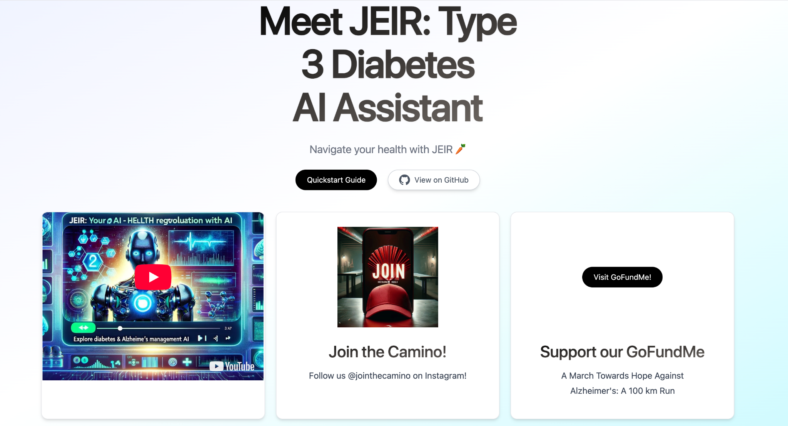
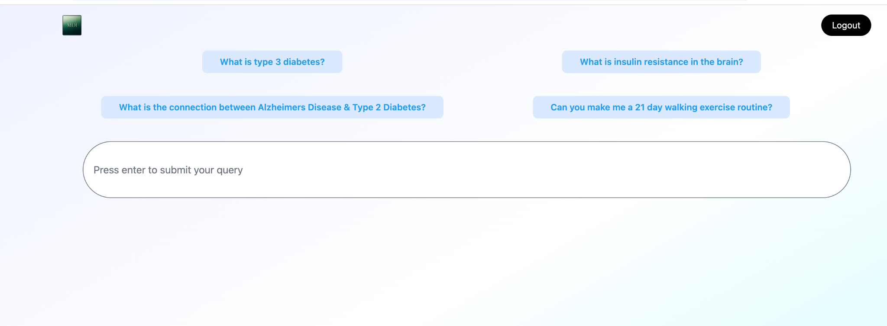
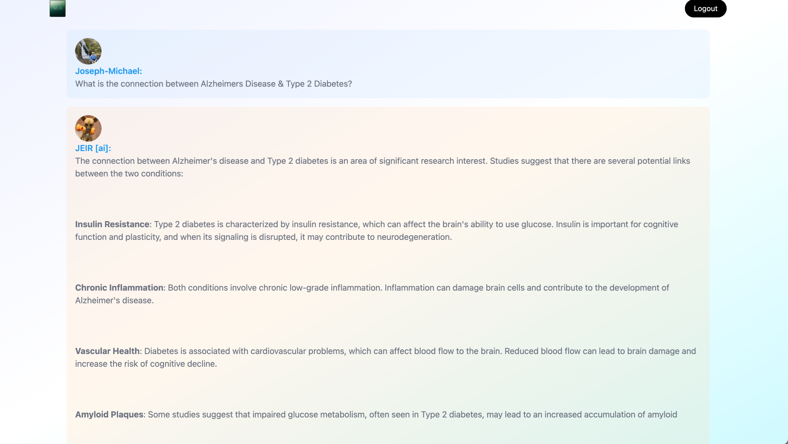

# JEIR — Type 3 Diabetes AI Assistant (Public Showcase)

> Navigate health education with **JEIR** 🥕 — an AI assistant that explains the science linking insulin resistance, metabolic health, and cognitive decline often described as “Type 3 diabetes.” Built by **Mindful Diabetes Inc.** for learning and empowerment.

[▶ Open JEIR](https://www.mindfuldiabetes.ai/) · [Alt Domain](https://jeir.ai) · [Privacy & Safety](#privacy--safety) · [Contact](#contact)

---

  

## What JEIR Does
- **Clear answers with sources** — Ask about insulin resistance in the brain, diet & exercise basics, the AD–T2D connection, and more.
- **Actionable suggestions** — e.g., “Can you make me a 21-day walking routine?”
- **Friendly guardrails** — Educational tone, plain-language summaries, and reminders to consult clinicians for personal care.

> **Scope:** JEIR is an **educational assistant**. It does **not** diagnose, treat, or provide medical advice.

## Quickstart
1. **Open:** https://www.mindfuldiabetes.ai/ (or https://jeir.ai)  
2. **Sign in:** Email or **Continue with Google** (Kinde Authentication).
3. **Ask a question:** Use the suggested prompts or type your own.
4. **Review sources:** Where applicable, JEIR includes citations/sourcing to help you learn more.

  

## Example
**You:** *What is the connection between Alzheimer’s Disease & Type 2 Diabetes?*  
**JEIR:** Explains evidence around insulin resistance, chronic inflammation, vascular health, amyloid burden, and shared lifestyle risk factors — with plain-language takeaways and references.

  

  

## How It Works (High-Level)
- **Web app UI** for chat + suggested prompts
- **Auth via Kinde** (email/Google) to protect usage and settings
- **Retrieval-augmented generation** over a **curated knowledge base** (Mindful Diabetes content and reputable sources)
- **Citations/links** surfaced where available
- **Guardrails** to keep responses educational and safety-aware

*Production code is private. This repository is a public, docs-only showcase.*

## Privac
